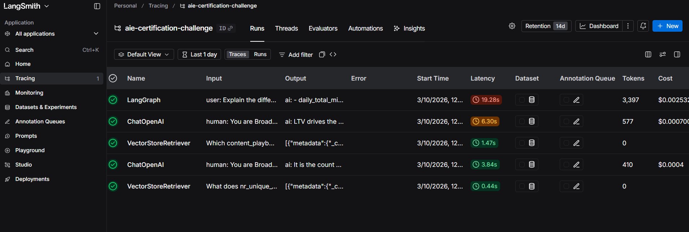
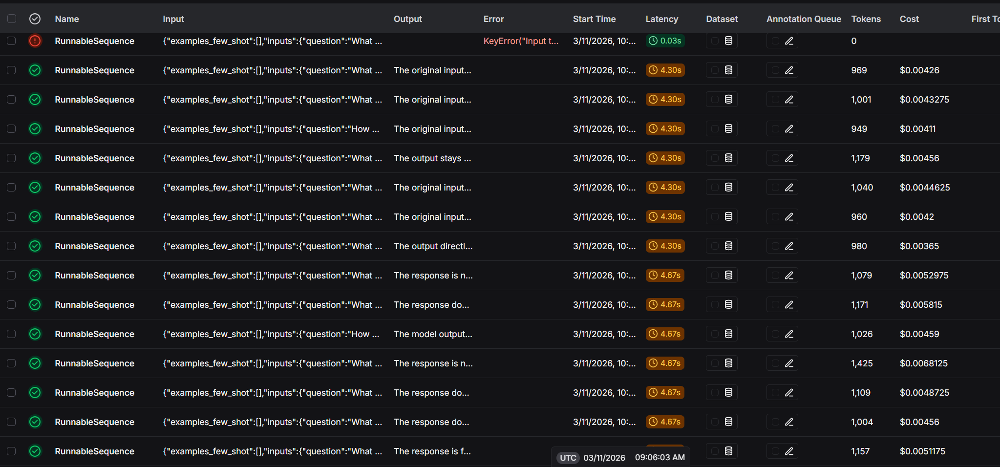

## LangSmith Tracing – BroadcastIQ

Project: **BroadcastIQ IPTV Analytics Assistant**

### Overview

LangSmith was integrated into the BroadcastIQ project to provide observability and debugging capabilities for the agentic architecture. LangSmith enables developers to inspect the full execution path of the AI agent, including model calls, tool usage, and reasoning steps.

### Why LangSmith was used

BroadcastIQ relies on an agent architecture built with LangGraph and LangChain tools. During development it was important to understand how the agent:

- **selects tools**
- **generates SQL queries**
- **retrieves context** from the vector database
- **produces final responses**

LangSmith provides full trace visibility into these steps.

### Tracing setup

LangSmith tracing is enabled through environment variables in the backend configuration. Example configuration:

- **LANGCHAIN_TRACING_V2**=`true`
- **LANGSMITH_TRACING**=`true`
- **LANGSMITH_API_KEY**=`<api_key>`
- **LANGSMITH_PROJECT**=`aie-certification-challenge`

Once enabled, every agent run is automatically logged in LangSmith.

### What is visible in LangSmith

For each user query the following information is captured:

- **user input**
- **LLM reasoning steps**
- **tool calls** (`tv_sql`, retrieval, `web_search`)
- **intermediate outputs**
- **final response**

This makes it possible to debug and analyze the agent’s behavior.

### Example trace

Example query used during development:

> "Top 5 channels by AVG viewing minutes in the last 3 months"

LangSmith trace shows:

- **user message received**
- **agent selects SQL tool**
- **SQL query generated and executed**
- **results processed by the model**
- **final structured response returned**

### Benefits for development

Using LangSmith significantly improved the development workflow by allowing:

- **inspection of agent reasoning**
- **debugging of tool usage**
- **validation of SQL queries generated by the model**
- **better understanding of retrieval behavior**

This helped improve reliability of the BroadcastIQ assistant.

### Example

Links : 

https://eu.smith.langchain.com/public/f0d3cb90-669d-4c14-aafe-8e4a74c4fdbe/r

https://eu.smith.langchain.com/public/13675821-b646-4114-9338-8a19afe02309/r

https://eu.smith.langchain.com/public/ee40dcca-35b5-494a-b76b-93363f000e0e/r

https://eu.smith.langchain.com/public/5fabf861-b74a-4490-99ca-f316e417edf7/r

https://eu.smith.langchain.com/public/2874dfc8-3a7c-48b7-afbc-de305bc589a9/r

### LangSmith Evaluation of testset_tv

We created a LangSmith dataset from `testset_tv.json` and used it to run evaluation experiments on the agent.  
The dataset contains synthetic queries with ground truth answers and reference contexts.

LangSmith traces and experiments allow systematic testing of agent responses against the expected answers.

Links :

https://eu.smith.langchain.com/public/23c1b4ea-e645-458a-8016-5f7ccfb0e217/d

https://eu.smith.langchain.com/public/5d33c607-0cee-45eb-83a3-2c71fe53f5c3/r

https://eu.smith.langchain.com/public/2dbec6f1-7c22-4651-b018-f38ab68f2a13/r

https://eu.smith.langchain.com/public/517ccda6-635a-461c-83b9-09cf12d96469/r

### Conclusion

LangSmith provides critical observability for agent-based applications and was used during the development of BroadcastIQ to monitor and debug agent execution. The tracing functionality ensures transparency and makes it easier to evaluate how the agent arrives at its answers.
